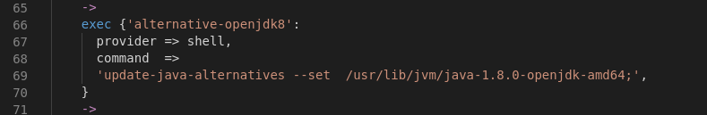

## SOURCE

*   https://github.com/dkilfoyle/vagrant-rstudio


-----

## RUNNING

*   Webmin at https://127.0.0.1:10000/


-----

## TESTING

### Activating and deactivating puppet services


## PROBLEMS

### Fixed lack of file makeshinylinks.sh

Sync project folder with VM folder `/vagrant`:

```
config.vm.synced_folder ".", "/vagrant", disabled: false
```


Add folder R under `shiny-server`  folder


Put here any Shiny projects that want to share. It will need to reboot Shiny server.


### Problem starting shiny-server

But the server starts the same.


This is `makeshinylinks.sh` script:


### opencpu update repo failing


### RStudio too old

Update to a newer version of rstudio-server for `trusty64`


### update and install newer version of libgit2 and libssh2


### update Java alternatives to Java 1.8 JDK





### Install java8 and java11 for more Java options


### opencpu


Fix to this error:


Puppet script:

```
class install_opencpu {
    exec {'add-opencpu-repository':`
      provider => shell,
      command  =>
        'add-apt-repository ppa:opencpu/opencpu-1.6;
         apt-get update;
         apt-get upgrade;
         ',
     }
    ->
    package { 'opencpu' :
      ensure => installed,
    }
}
```


### Install javajdk8

```
'default-jdk', 'gdebi-core', 'libcurl4-gnutls-dev']:
```


### Fixed problem with opencpu

https://www.opencpu.org/download.html


```
class install_opencpu {
    exec {'add-opencpu-repository':
      provider => shell,
      command  =>
        'add-apt-repository ppa:opencpu/opencpu-1.6;
         apt-get update;
         apt-get upgrade;
         ',
     }
    ->
    package { 'opencpu' :
      ensure => installed,
    }
}
```


```
options("repos"="http://cran.rstudio.com") # set the cran mirror

packages = c("BH", "devtools", "ggplot2", "dplyr", "tidyr", "RcppEigen", "stringr", "gridExtra",
             "RCurl", "RJSONIO", "RJDBC", "knitr", "lme4", "latticeExtra", "RMySQL",
             "XLConnect", "Cairo", "opencpu", "rstudio")
packages = setdiff(packages, installed.packages()[, "Package"])
if (length(packages) != 0) {
  (install.packages(packages, dep = c("Depends", "Imports")))
}

# Packages from github are installed unconditionally
ghpackages = c("rstudio/htmltools", "trestletech/shinyTable", "rstudio/rmarkdown", "rstudio/shiny")
devtools::install_github(ghpackages)
#ghFrame = do.call(rbind, strsplit(ghpackages,"/"))

#reqPackages = setdiff(ghFrame[,2], installed.packages()[,"Package"])
#ghPack = ghFrame[ghFrame[,2]==reqPackages,,drop=FALSE]
#
#if (nrow(ghPack) != 0){
#  (devtools::install_github(apply(ghPack,1,paste,collapse="/")))
#}
update.packages(ask = FALSE)
```


```
 sudo add-apt-repository ppa:cran/libgit2
 sudo apt-get update
 sudo apt-get install libssh2-1-dev libgit2-dev
```


*   With Bionic there seems to be a problem with puppet:
    

Trying to install R repository for `trusty64`:
```
Ign http://archive.ubuntu.com trusty/universe Translation-en_US                
Fetched 488 B in 8s (60 B/s)                                                   
Reading package lists... Done
W: GPG error: http://cran.rstudio.com trusty/ Release: The following signatures couldn't be verified because the public key is not available: NO_PUBKEY 51716619E084DAB9
```


### hiera.yaml

`Warning: Config file /etc/puppet/hiera.yaml not found, using Hiera defaults`


### puppet maestrodev-get

`    default: Error: Could not install module 'maestrodev-wget' (latest)`


Add `--force` parameter. Change the puppet command to:


### Do not run opencpu

Because cannot find repository.

