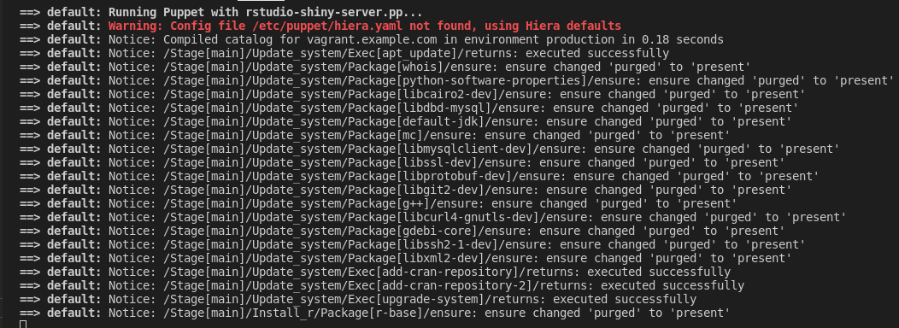

## TODO
* Add Shiny examples to `./shiny-server/R`
* Add Jupyter server
* If possible, upgrade to `bionic64`

# 20210119

*   Launch OpenCPU with http://127.0.0.1:8082/ocpu/

*   Sync project folder `.` with VM folder `/vagrant`. Put here any Shiny projects that want to share. It will need to reboot Shiny server.

*   Add subfolder `R` under `shiny-server`  folder.

*   Install newer version of rstudio-server

    ```
    # $rstudioserver = 'rstudio-server-0.98.1091-amd64.deb'
    # $urlrstudio = 'https://s3.amazonaws.com/rstudio-dailybuilds/'
    $rstudioserver = 'rstudio-server-1.2.5042-amd64.deb'
    $urlrstudio = 'https://download2.rstudio.org/server/trusty/amd64/'
    ```

*   Add flag `-y` when adding opencpu repository

    ```
    'add-apt-repository ppa:opencpu/opencpu-1.6 -y;
    ```

    

*   Add java11-jdk

*   Java set alternatives fixed


*    Using wrong command to update Java alternatives

From:

```
    exec {'alternative-openjdk8':
      provider => shell,
      command  =>
      'update-alternatives --set  /usr/lib/jvm/java-1.8.0-openjdk-amd64;',
    }
```

Which generates this error:


To:

```
    exec {'alternative-openjdk8':
      provider => shell,
      command  =>
      'update-java-alternatives --set  /usr/lib/jvm/java-1.8.0-openjdk-amd64;',
    }
```


*   Problem with Java and gitlib2 and `libssh2`


```
==> default: Error: update-alternatives --set /usr/lib/jvm/java-1.8.0-openjdk-amd64; returned 2 instead of one of [0]
==> default: Error: /Stage[main]/Update_system/Exec[set-alternative-openjdk8]/returns: change from notrun to 0 failed: update-alternatives --set /usr/lib/jvm/java-1.8.0-openjdk-amd64; returned 2 instead of one of [0]

==> default: Warning: /Stage[main]/Update_system/Exec[update-gitlib2]: Skipping because of failed dependencies
==> default: Notice: /Stage[main]/Update_system/Package[libgit2-dev]: Dependency Exec[set-alternative-openjdk8] has failures: true
==> default: Warning: /Stage[main]/Update_system/Package[libgit2-dev]: Skipping because of failed dependencies

==> default: Notice: /Stage[main]/Update_system/Package[libssh2-1-dev]: Dependency Exec[set-alternative-openjdk8] has failures: true
==> default: Warning: /Stage[main]/Update_system/Package[libssh2-1-dev]: Skipping because of failed dependencies

==> default: Notice: /Stage[main]/Update_system/Exec[add-cran-repository]: Dependency Exec[set-alternative-openjdk8] has failures: true
==> default: Warning: /Stage[main]/Update_system/Exec[add-cran-repository]: Skipping because of failed dependencies

==> default: Notice: /Stage[main]/Update_system/Exec[upgrade-system]: Dependency Exec[set-alternative-openjdk8] has failures: true
==> default: Warning: /Stage[main]/Update_system/Exec[upgrade-system]: Skipping because of failed dependencies
==> default: Notice: /Stage[main]/Update_system/Package[dkms]: Dependency Exec[set-alternative-openjdk8] has failures: true
==> default: Warning: /Stage[main]/Update_system/Package[dkms]: Skipping because of failed dependencies
==> default: Notice: /Stage[main]/Install_r/Package[r-base]: Dependency Exec[set-alternative-openjdk8] has failures: true
==> default: Warning: /Stage[main]/Install_r/Package[r-base]: Skipping because of failed dependencies
==> default: Notice: /Stage[main]/Install_r/Package[r-base-dev]: Dependency Exec[set-alternative-openjdk8] has failures: true
==> default: Warning: /Stage[main]/Install_r/Package[r-base-dev]: Skipping because of failed dependencies
==> default: Notice: /Stage[main]/Install_r/Exec[install-r-packages]: Dependency Exec[set-alternative-openjdk8] has failures: true
==> default: Warning: /Stage[main]/Install_r/Exec[install-r-packages]: Skipping because of failed dependencies
==> default: Notice: /Stage[main]/Webmin/Package[libnet-ssleay-perl]/ensure: ensure changed 'purged' to 'present'
==> default: Notice: /Stage[main]/Webmin/Exec[DownloadWebmin]/returns: executed successfully
==> default: Notice: /Stage[main]/Webmin/Exec[InstallWebmin]/returns: executed successfully
==> default: Notice: /Stage[main]/Webmin/Service[webmin]: Triggered 'refresh' from 1 events
==> default: Notice: Finished catalog run in 190.87 seconds
The SSH command responded with a non-zero exit status. Vagrant
assumes that this means the command failed. The output for this command
should be in the log above. Please read the output to determine what
went wrong.

```


# 20210118

*   After adding dependencies still not working. Need to add repository from script.
    

    

*   

* Error installing R dependencies
    

    ```
    Error: package or namespace load failed for ‘XLConnect’:
    error: Installed java version 1.7.0_201-b00 is not between Java>=8 and <=11! This is needed for this package
    ERROR: dependency ‘later’ is not available for package ‘promises’
    ERROR: dependency ‘nloptr’ is not available for package ‘lme4’
    ERROR: dependency ‘promises’ is not available for package ‘DT’
    ERROR: dependencies ‘promises’, ‘later’, ‘BH’ are not available for package ‘httpuv’
    
    Configuration failed to find libgit2 library. Try installing:
     * brew: libgit2 (MacOS)
     * deb: libgit2-dev (Debian, Ubuntu, etc)
    * rpm: libgit2-devel (Fedora, CentOS, RHEL)
    
    
    ```

    

* Change key from this old:

    

    to this new updated one:

    ```
    apt-key adv --keyserver keyserver.ubuntu.com --recv-keys 51716619E084DAB9;
    ```

    

* Webmin running after **second cloning** of VM.

* Build VM step by step
    

* Clone repo and start over because receiving too many errors from puppet modules.

* Activating and deactivating puppet services
    ```
    include webmin
    include update_system
    include install_r
    # include install_opencpu
    # include install_shiny_server
    # include install_rstudio_server
    # include check_services
    # include startupscript
    ```
    
* Create puppet manifest for `bionic64` and `trusty`.

* Change to `bionic64` instead of `trusty`. Some R packages canno install

* Clone repo